# Q2-OP-I1 — Schéma global modules / workflows / statuts / actions

Objectif : cartographier les modules ERP, leurs statuts, workflows, transitions, actions, règles métier et vérifier que les boutons de workflow ne sont pas portés par les formulaires.

## Résumé

- Modules analysés : 37
- OK : 60
- INFO : 33
- WARN : 2
- WARN HIGH : 2
- FAIL : 0
- FAIL HIGH : 0

## Doctrine cible

- Les formulaires affichent et saisissent des champs.
- Les workflows, transitions et actions métier sont rendus par le runtime autour du formulaire.
- Les statuts ne sont pas des commandes libres.
- Les changements d’état passent par des actions contrôlées : RuntimeActionEngine / RuntimeWorkflowEngine / Business Rules.
- Les créations enfant passent par RuntimeChildCreateHrefBuilder ou par composition.children, jamais par des URLs codées à la main.

## Alertes principales

| Area | Status | Severity | File | Message |
|---|---:|---:|---|---|
| module-workflow | OK | HIGH | `src/runtime/modules/generated/budgets/budgets.module.ts` | budgets: workflow detected (3 workflow key marker(s), 0 transition(s)) |
| module-actions | INFO | HIGH | `src/runtime/modules/generated/budgets/budgets.module.ts` | budgets: actions metadata or actions file detected |
| module-workflow | OK | HIGH | `src/runtime/modules/generated/campagnes/campagnes.module.ts` | campagnes: workflow detected (3 workflow key marker(s), 0 transition(s)) |
| module-actions | INFO | HIGH | `src/runtime/modules/generated/campagnes/campagnes.module.ts` | campagnes: actions metadata or actions file detected |
| module-workflow | OK | HIGH | `src/runtime/modules/generated/clientsauto/clientsauto.module.ts` | clientsauto: workflow detected (12 workflow key marker(s), 0 transition(s)) |
| module-actions | INFO | HIGH | `src/runtime/modules/generated/clientsauto/clientsauto.module.ts` | clientsauto: actions metadata or actions file detected |
| module-workflow | OK | HIGH | `src/runtime/modules/generated/commandesstockauto/commandesstockauto.module.ts` | commandesstockauto: workflow detected (8 workflow key marker(s), 0 transition(s)) |
| module-workflow | OK | HIGH | `src/runtime/modules/generated/contrats/contrats.module.ts` | contrats: workflow detected (3 workflow key marker(s), 0 transition(s)) |
| module-actions | INFO | HIGH | `src/runtime/modules/generated/contrats/contrats.module.ts` | contrats: actions metadata or actions file detected |
| module-workflow | OK | HIGH | `src/runtime/modules/generated/echeancespaiementauto/echeancespaiementauto.module.ts` | echeancespaiementauto: workflow detected (10 workflow key marker(s), 0 transition(s)) |
| module-actions | INFO | HIGH | `src/runtime/modules/generated/echeancespaiementauto/echeancespaiementauto.module.ts` | echeancespaiementauto: actions metadata or actions file detected |
| module-workflow | OK | HIGH | `src/runtime/modules/generated/encaissementsauto/encaissementsauto.module.ts` | encaissementsauto: workflow detected (15 workflow key marker(s), 0 transition(s)) |
| module-actions | INFO | HIGH | `src/runtime/modules/generated/encaissementsauto/encaissementsauto.module.ts` | encaissementsauto: actions metadata or actions file detected |
| module-workflow | OK | HIGH | `src/runtime/modules/generated/facturations/facturations.module.ts` | facturations: workflow detected (3 workflow key marker(s), 0 transition(s)) |
| module-actions | INFO | HIGH | `src/runtime/modules/generated/facturations/facturations.module.ts` | facturations: actions metadata or actions file detected |
| module-workflow | OK | HIGH | `src/runtime/modules/generated/facturesauto/facturesauto.module.ts` | facturesauto: workflow detected (19 workflow key marker(s), 0 transition(s)) |
| module-actions | INFO | HIGH | `src/runtime/modules/generated/facturesauto/facturesauto.module.ts` | facturesauto: actions metadata or actions file detected |
| module-workflow | OK | HIGH | `src/runtime/modules/generated/fournisseursauto/fournisseursauto.module.ts` | fournisseursauto: workflow detected (9 workflow key marker(s), 0 transition(s)) |
| module-workflow | OK | HIGH | `src/runtime/modules/generated/interventionsauto/interventionsauto.module.ts` | interventionsauto: workflow detected (12 workflow key marker(s), 0 transition(s)) |
| module-actions | INFO | HIGH | `src/runtime/modules/generated/interventionsauto/interventionsauto.module.ts` | interventionsauto: actions metadata or actions file detected |
| module-workflow | OK | HIGH | `src/runtime/modules/generated/lignescommandestockauto/lignescommandestockauto.module.ts` | lignescommandestockauto: workflow detected (10 workflow key marker(s), 0 transition(s)) |
| module-workflow | OK | HIGH | `src/runtime/modules/generated/lignesinterventionauto/lignesinterventionauto.module.ts` | lignesinterventionauto: workflow detected (21 workflow key marker(s), 0 transition(s)) |
| module-actions | INFO | HIGH | `src/runtime/modules/generated/lignesinterventionauto/lignesinterventionauto.module.ts` | lignesinterventionauto: actions metadata or actions file detected |
| module-workflow | OK | HIGH | `src/runtime/modules/generated/mouvementsstockauto/mouvementsstockauto.module.ts` | mouvementsstockauto: workflow detected (14 workflow key marker(s), 0 transition(s)) |
| module-actions | INFO | HIGH | `src/runtime/modules/generated/mouvementsstockauto/mouvementsstockauto.module.ts` | mouvementsstockauto: actions metadata or actions file detected |
| module-workflow | OK | HIGH | `src/runtime/modules/generated/produitsauto/produitsauto.module.ts` | produitsauto: workflow detected (36 workflow key marker(s), 0 transition(s)) |
| module-actions | INFO | HIGH | `src/runtime/modules/generated/produitsauto/produitsauto.module.ts` | produitsauto: actions metadata or actions file detected |
| module-workflow | OK | HIGH | `src/runtime/modules/generated/rappelsauto/rappelsauto.module.ts` | rappelsauto: workflow detected (7 workflow key marker(s), 0 transition(s)) |
| module-actions | INFO | HIGH | `src/runtime/modules/generated/rappelsauto/rappelsauto.module.ts` | rappelsauto: actions metadata or actions file detected |
| module-workflow | OK | HIGH | `src/runtime/modules/generated/receptionsstockauto/receptionsstockauto.module.ts` | receptionsstockauto: workflow detected (11 workflow key marker(s), 0 transition(s)) |
| module-workflow | OK | HIGH | `src/runtime/modules/generated/rendezvous/rendezvous.module.ts` | rendezvous: workflow detected (13 workflow key marker(s), 0 transition(s)) |
| module-actions | INFO | HIGH | `src/runtime/modules/generated/rendezvous/rendezvous.module.ts` | rendezvous: actions metadata or actions file detected |
| module-workflow | OK | HIGH | `src/runtime/modules/generated/stocksauto/stocksauto.module.ts` | stocksauto: workflow detected (7 workflow key marker(s), 0 transition(s)) |
| module-actions | INFO | HIGH | `src/runtime/modules/generated/stocksauto/stocksauto.module.ts` | stocksauto: actions metadata or actions file detected |
| module-workflow | OK | HIGH | `src/runtime/modules/generated/vehicules/vehicules.module.ts` | vehicules: workflow detected (15 workflow key marker(s), 0 transition(s)) |
| module-actions | INFO | HIGH | `src/runtime/modules/generated/vehicules/vehicules.module.ts` | vehicules: actions metadata or actions file detected |
| module-status | INFO | LOW | `src/runtime/modules/definitions/coreModules.ts` | incidents: no explicit status field detected |
| module-workflow | OK | HIGH | `src/runtime/modules/definitions/coreModules.ts` | incidents: workflow detected (1 workflow key marker(s), 0 transition(s)) |
| module-workflow | INFO | MEDIUM | `src/runtime/modules/definitions/generated/campagnes.module.ts` | campagnes: no workflow detected |
| module-workflow | INFO | MEDIUM | `src/runtime/modules/definitions/generated/commandes.module.ts` | commandes: no workflow detected |
| module-workflow | INFO | MEDIUM | `src/runtime/modules/definitions/generated/contrats.module.ts` | contrats: no workflow detected |
| module-workflow | INFO | MEDIUM | `src/runtime/modules/definitions/generated/cultures.module.ts` | cultures: no workflow detected |
| module-workflow | INFO | MEDIUM | `src/runtime/modules/definitions/generated/employes.module.ts` | employes: no workflow detected |
| module-workflow | INFO | MEDIUM | `src/runtime/modules/definitions/generated/exploitations.module.ts` | exploitations: no workflow detected |
| module-workflow | INFO | MEDIUM | `src/runtime/modules/definitions/generated/factures.module.ts` | factures: no workflow detected |
| module-workflow | INFO | MEDIUM | `src/runtime/modules/definitions/generated/interventions.module.ts` | interventions: no workflow detected |
| module-workflow | INFO | MEDIUM | `src/runtime/modules/definitions/generated/livraisons.module.ts` | livraisons: no workflow detected |
| module-workflow | INFO | MEDIUM | `src/runtime/modules/definitions/generated/maintenance.module.ts` | maintenance: no workflow detected |
| module-workflow | INFO | MEDIUM | `src/runtime/modules/definitions/generated/materiels.module.ts` | materiels: no workflow detected |
| module-workflow | INFO | MEDIUM | `src/runtime/modules/definitions/generated/mouvements.module.ts` | mouvements: no workflow detected |
| module-workflow | INFO | MEDIUM | `src/runtime/modules/definitions/generated/paiements.module.ts` | paiements: no workflow detected |
| module-workflow | INFO | MEDIUM | `src/runtime/modules/definitions/generated/produits.module.ts` | produits: no workflow detected |
| module-workflow | INFO | MEDIUM | `src/runtime/modules/definitions/generated/stocks.module.ts` | stocks: no workflow detected |
| module-workflow | INFO | MEDIUM | `src/runtime/modules/definitions/generated/terrains.module.ts` | terrains: no workflow detected |
| form-actions | WARN | HIGH | `src/components/erp/forms/enterprise/ERPEnterpriseForm.tsx` | ERPEnterpriseForm still contains workflow/action rendering markers: workflowActions, RuntimeActionEngine, workflowActions.map, ERPButton. Target architecture: forms should not render workflow buttons. |
| form-actions | WARN | HIGH | `src/components/erp/runtime/ERPRuntimePage.tsx` | ERPRuntimePage passes workflowActions into ERPEnterpriseForm. Target architecture: render actions outside the form. |
| runtime-actions | OK | HIGH | `src/components/erp/runtime/ERPRuntimePage.tsx` | ERPRuntimePage renders runtime actions outside the detail view/form. |
| business-rules | OK | HIGH | `src/runtime/business-rules/runtimeBusinessRules.ts` | Business rules file contains workflow/side-effect markers: rendezvous, interventionsauto, facturesauto, encaissementsauto, statut, create, update |
| guards | OK | HIGH | `src/runtime/guards/processRuntimeBeforeMutationGuards.ts` | Parent/child guard markers present: requiresParentContext, parentModuleKey, parentRecordId, parentForeignKey, RuntimeContextEnforcer |

## Vue synthétique par module

| Module | Label | Statuts | Workflows | Transitions | Actions | Enfants | Risque href manuel |
|---|---|---|---:|---:|---:|---:|---:|
| budgets | Budgets | statut | oui | 0 | oui | 0 | non |
| campagnes | Campagnes | statut | oui | 0 | oui | 0 | non |
| campagnes | Campagnes | statut | non | 0 | 0 | 0 | non |
| clientsauto | Clients | statut | oui | 0 | 32 | 0 | non |
| commandes | Commandes | statut | non | 0 | 0 | 0 | non |
| commandesstockauto | Commandes stock | statut | oui | 0 | 0 | 0 | non |
| contrats | Contrats | statut | oui | 0 | oui | 0 | non |
| contrats | Contrats | statut | non | 0 | 0 | 0 | non |
| cultures | Cultures | statut | non | 0 | 0 | 0 | non |
| echeancespaiementauto | Échéances paiement | statut | oui | 0 | 28 | 0 | non |
| employes | Employes | statut | non | 0 | 0 | 0 | non |
| encaissementsauto | Encaissements | statut, statutEnvoiRecu | oui | 0 | 40 | 0 | non |
| exploitations | Exploitations | statut | non | 0 | 0 | 0 | non |
| facturations | Facturations | statut | oui | 0 | oui | 0 | non |
| factures | Factures | statut | non | 0 | 0 | 0 | non |
| facturesauto | Factures | statutFacture, statutPaiement, statutEnvoiFacture | oui | 0 | 56 | 0 | non |
| fournisseursauto | Fournisseurs | statut | oui | 0 | 0 | 0 | non |
| incidents | Incidents | - | oui | 0 | 0 | 0 | non |
| interventions | Interventions | statut | non | 0 | 0 | 0 | non |
| interventionsauto | Interventions | statut | oui | 0 | 37 | 0 | non |
| lignescommandestockauto | Lignes commande stock | statut | oui | 0 | 0 | 0 | non |
| lignesinterventionauto | Lignes intervention | statut | oui | 0 | 32 | 0 | non |
| livraisons | Livraisons | statut | non | 0 | 0 | 0 | non |
| maintenance | Maintenance | statut | non | 0 | 0 | 0 | non |
| materiels | Materiels | statut | non | 0 | 0 | 0 | non |
| mouvements | Mouvements | statut | non | 0 | 0 | 0 | non |
| mouvementsstockauto | Mouvements stock | statut | oui | 0 | oui | 0 | non |
| paiements | Paiements | statut | non | 0 | 0 | 0 | non |
| produits | Produits | statut | non | 0 | 0 | 0 | non |
| produitsauto | Produits | statut | oui | 0 | oui | 0 | non |
| rappelsauto | Rappels | statut | oui | 0 | oui | 0 | non |
| receptionsstockauto | Receptions stock | statut | oui | 0 | 0 | 0 | non |
| rendezvous | Rendez-vous | statut | oui | 0 | 36 | 0 | non |
| stocks | Stocks | statut | non | 0 | 0 | 0 | non |
| stocksauto | Stocks | statut | oui | 0 | oui | 0 | non |
| terrains | Terrains | statut | non | 0 | 0 | 0 | non |
| vehicules | Véhicules | statut | oui | 0 | oui | 0 | non |

## Schémas détaillés par module

### Budgets — `budgets`

- Fichier : `src/runtime/modules/generated/budgets/budgets.module.ts`
- Champs de statut : `statut`
- Workflow : oui
- États détectés : non détectés
- Actions détectées : aucune action explicite détectée
- Enfants/composition : aucun enfant détecté

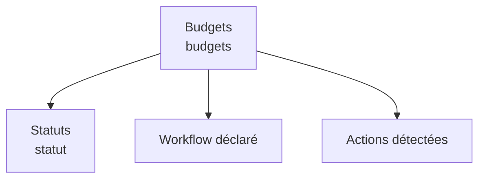

### Campagnes — `campagnes`

- Fichier : `src/runtime/modules/generated/campagnes/campagnes.module.ts`
- Champs de statut : `statut`
- Workflow : oui
- États détectés : non détectés
- Actions détectées : aucune action explicite détectée
- Enfants/composition : aucun enfant détecté

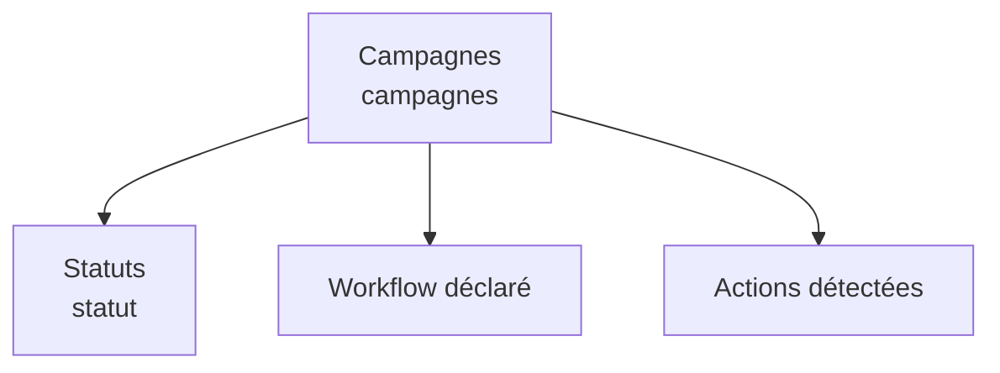

### Campagnes — `campagnes`

- Fichier : `src/runtime/modules/definitions/generated/campagnes.module.ts`
- Champs de statut : `statut`
- Workflow : non
- États détectés : non détectés
- Actions détectées : aucune action explicite détectée
- Enfants/composition : aucun enfant détecté

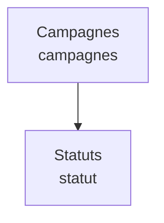

### Clients — `clientsauto`

- Fichier : `src/runtime/modules/generated/clientsauto/clientsauto.module.ts`
- Actions : `src/runtime/modules/generated/clientsauto/clientsauto.actions.ts`
- Champs de statut : `statut`
- Workflow : oui
- États détectés : non détectés
- Actions détectées : Clients, Code client, Nom, Prénom, Téléphone, Email, Adresse, Ville, Pays, Type client, Particulier, Entreprise, Flotte, Date inscription, Observations, Statut, Actif, Prospect, Inactif, Archivé, Identité, Véhicules, Notes, Total, Actifs, Prospects, Clients affichés, Clients actifs, Nouveau RDV, Fiche 360 demo, Cycle client, Client
- Enfants/composition : vehicules, rendezvous-client, interventions-client, factures-client, encaissements-client

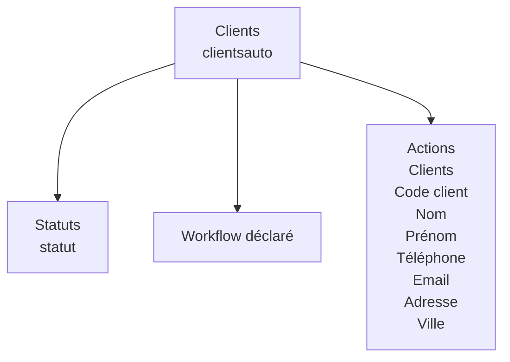

### Commandes — `commandes`

- Fichier : `src/runtime/modules/definitions/generated/commandes.module.ts`
- Champs de statut : `statut`
- Workflow : non
- États détectés : non détectés
- Actions détectées : aucune action explicite détectée
- Enfants/composition : aucun enfant détecté

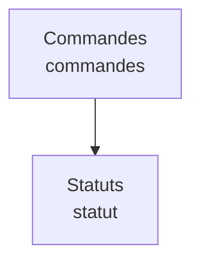

### Commandes stock — `commandesstockauto`

- Fichier : `src/runtime/modules/generated/commandesstockauto/commandesstockauto.module.ts`
- Champs de statut : `statut`
- Workflow : oui
- États détectés : non détectés
- Actions détectées : aucune action explicite détectée
- Enfants/composition : lignes-commandestock, receptions-stock

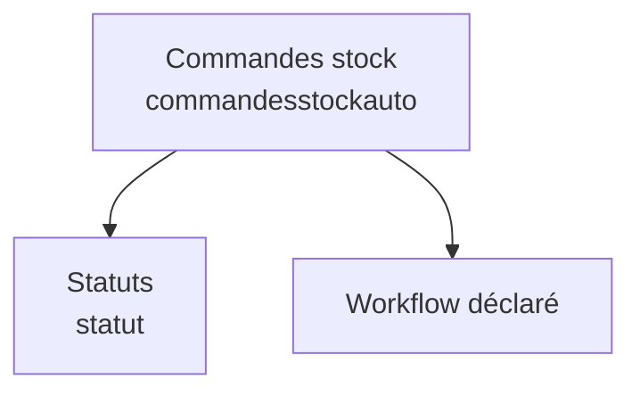

### Contrats — `contrats`

- Fichier : `src/runtime/modules/generated/contrats/contrats.module.ts`
- Actions : `src/runtime/modules/generated/contrats/contrats.actions.ts`
- Champs de statut : `statut`
- Workflow : oui
- États détectés : non détectés
- Actions détectées : aucune action explicite détectée
- Enfants/composition : aucun enfant détecté

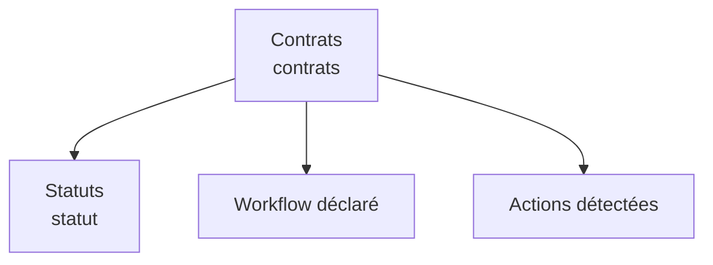

### Contrats — `contrats`

- Fichier : `src/runtime/modules/definitions/generated/contrats.module.ts`
- Champs de statut : `statut`
- Workflow : non
- États détectés : non détectés
- Actions détectées : aucune action explicite détectée
- Enfants/composition : aucun enfant détecté

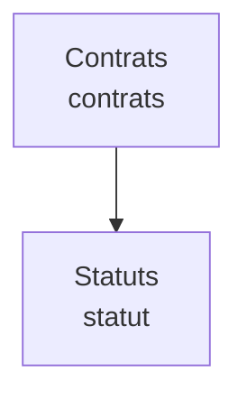

### Cultures — `cultures`

- Fichier : `src/runtime/modules/definitions/generated/cultures.module.ts`
- Champs de statut : `statut`
- Workflow : non
- États détectés : non détectés
- Actions détectées : aucune action explicite détectée
- Enfants/composition : aucun enfant détecté

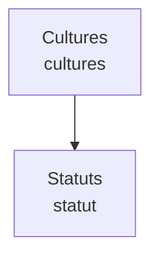

### Échéances paiement — `echeancespaiementauto`

- Fichier : `src/runtime/modules/generated/echeancespaiementauto/echeancespaiementauto.module.ts`
- Actions : `src/runtime/modules/generated/echeancespaiementauto/echeancespaiementauto.actions.ts`
- Champs de statut : `statut`
- Workflow : oui
- États détectés : non détectés
- Actions détectées : Échéances paiement, Facture, Client, Véhicule, Montant prévu, Montant payé, Date échéance, Statut, À venir, En retard, Partiellement payée, Payée, Annulée, Canal relance, WhatsApp, SMS, Notification, Téléphone, Email, Dernier rappel, Notes, Échéance, Relations, Relance, Cycle échéance, Marquer payée, Relancer le client, Annuler
- Enfants/composition : aucun enfant détecté

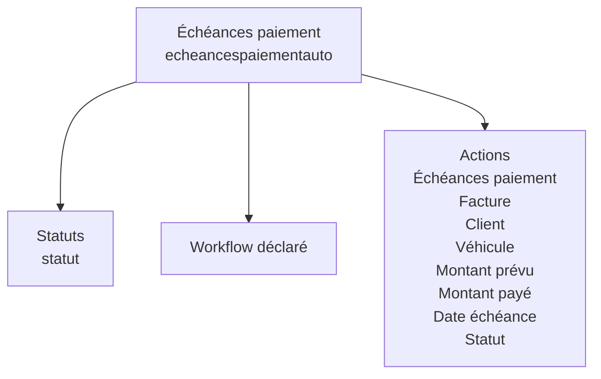

### Employes — `employes`

- Fichier : `src/runtime/modules/definitions/generated/employes.module.ts`
- Champs de statut : `statut`
- Workflow : non
- États détectés : non détectés
- Actions détectées : aucune action explicite détectée
- Enfants/composition : aucun enfant détecté

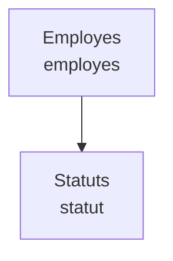

### Encaissements — `encaissementsauto`

- Fichier : `src/runtime/modules/generated/encaissementsauto/encaissementsauto.module.ts`
- Actions : `src/runtime/modules/generated/encaissementsauto/encaissementsauto.actions.ts`
- Champs de statut : `statut`, `statutEnvoiRecu`
- Workflow : oui
- États détectés : non détectés
- Actions détectées : Encaissements, Facture, Client, Véhicule, Montant encaissé, Date paiement, Mode paiement, Espèces, Mobile Money, Carte, Virement, Chèque, Autre, Référence transaction, Statut, En attente, Validé, Rejeté, Annulé, Numéro reçu, Statut envoi reçu, Non envoyé, Envoyé, Échec envoi, Dernier envoi reçu, Canal dernier envoi reçu, WhatsApp, SMS, Email, Manuel, Destinataire dernier envoi reçu, Nombre d, Notes, Paiement, Relations, Reçu, Cycle encaissement, Valider l’encaissement, Rejeter, Annuler
- Enfants/composition : aucun enfant détecté

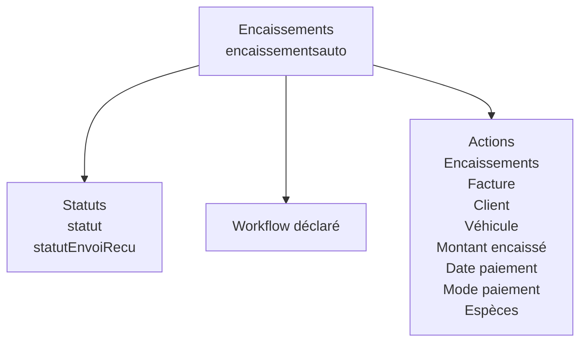

### Exploitations — `exploitations`

- Fichier : `src/runtime/modules/definitions/generated/exploitations.module.ts`
- Champs de statut : `statut`
- Workflow : non
- États détectés : non détectés
- Actions détectées : aucune action explicite détectée
- Enfants/composition : aucun enfant détecté

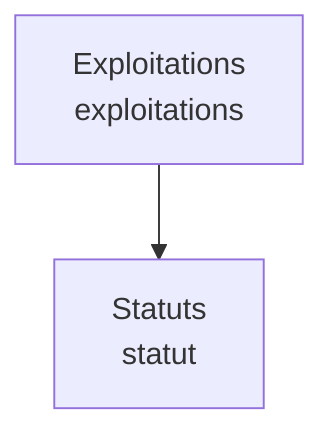

### Facturations — `facturations`

- Fichier : `src/runtime/modules/generated/facturations/facturations.module.ts`
- Actions : `src/runtime/modules/generated/facturations/facturations.actions.ts`
- Champs de statut : `statut`
- Workflow : oui
- États détectés : non détectés
- Actions détectées : aucune action explicite détectée
- Enfants/composition : aucun enfant détecté


### Factures — `factures`

- Fichier : `src/runtime/modules/definitions/generated/factures.module.ts`
- Champs de statut : `statut`
- Workflow : non
- États détectés : non détectés
- Actions détectées : aucune action explicite détectée
- Enfants/composition : aucun enfant détecté

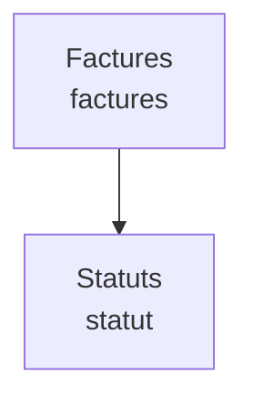

### Factures — `facturesauto`

- Fichier : `src/runtime/modules/generated/facturesauto/facturesauto.module.ts`
- Actions : `src/runtime/modules/generated/facturesauto/facturesauto.actions.ts`
- Champs de statut : `statutFacture`, `statutPaiement`, `statutEnvoiFacture`
- Workflow : oui
- États détectés : non détectés
- Actions détectées : Factures, Numéro facture, Date facture, Statut facture, Brouillon, Émise, Annulée, Statut paiement, En attente, Partiel, Payé, Client, Véhicule, Intervention, Montant HT, Taux TVA (%), Montant TTC, Montant payé, Reste à payer, Mode paiement, Espèces, Carte, Virement, Mobile Money, Statut envoi facture, Non envoyée, Envoyée, Échec envoi, Dernier envoi facture, Canal dernier envoi, WhatsApp, SMS, Email, Lien, Manuel, Destinataire dernier envoi, Nombre d, Observations, Facture, Relations, Finance, Envoi, Notes, Total, Partielles, Payées, Annulées, Factures affichées, Cycle facture, Paiement partiel, Valider la facture, Marquer payée, Enregistrer un paiement, Marquer comme envoyée, Relancer le client, Annuler
- Enfants/composition : encaissements-facture, echeances-facture

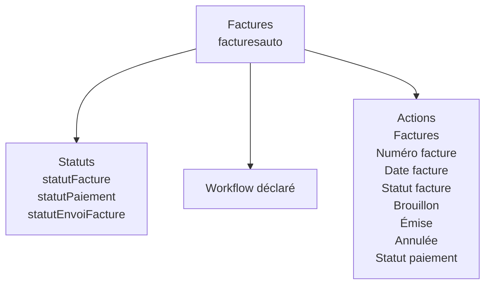

### Fournisseurs — `fournisseursauto`

- Fichier : `src/runtime/modules/generated/fournisseursauto/fournisseursauto.module.ts`
- Champs de statut : `statut`
- Workflow : oui
- États détectés : non détectés
- Actions détectées : aucune action explicite détectée
- Enfants/composition : aucun enfant détecté

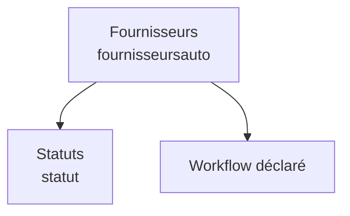

### Incidents — `incidents`

- Fichier : `src/runtime/modules/definitions/coreModules.ts`
- Actions : `src/runtime/modules/definitions/coreModules.ts`
- Champs de statut : aucun détecté
- Workflow : oui
- États détectés : non détectés
- Actions détectées : aucune action explicite détectée
- Enfants/composition : aucun enfant détecté

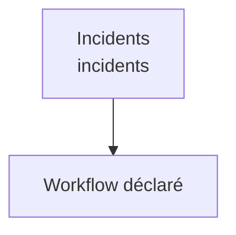

### Interventions — `interventions`

- Fichier : `src/runtime/modules/definitions/generated/interventions.module.ts`
- Champs de statut : `statut`
- Workflow : non
- États détectés : non détectés
- Actions détectées : aucune action explicite détectée
- Enfants/composition : aucun enfant détecté

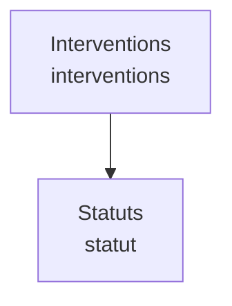

### Interventions — `interventionsauto`

- Fichier : `src/runtime/modules/generated/interventionsauto/interventionsauto.module.ts`
- Actions : `src/runtime/modules/generated/interventionsauto/interventionsauto.actions.ts`
- Champs de statut : `statut`
- Workflow : oui
- États détectés : non détectés
- Actions détectées : Interventions, Client, Véhicule, Rendez-vous, Date intervention, Type intervention, Vidange, Diagnostic, Réparation, Pneumatiques, Contrôle, Autre, Kilométrage, Travaux effectués, Coût pièces, Coût main d, Coût total, Statut, Ouverte, En cours, Terminée, Facturée, Annulée, Contexte, Atelier, Coûts, Total, Ouvertes, Terminées, Annulées, Interventions affichées, Cycle intervention, Démarrer l, Passer en diagnostic, Terminer l, Générer la facture, Annuler
- Enfants/composition : lignes, factures-intervention

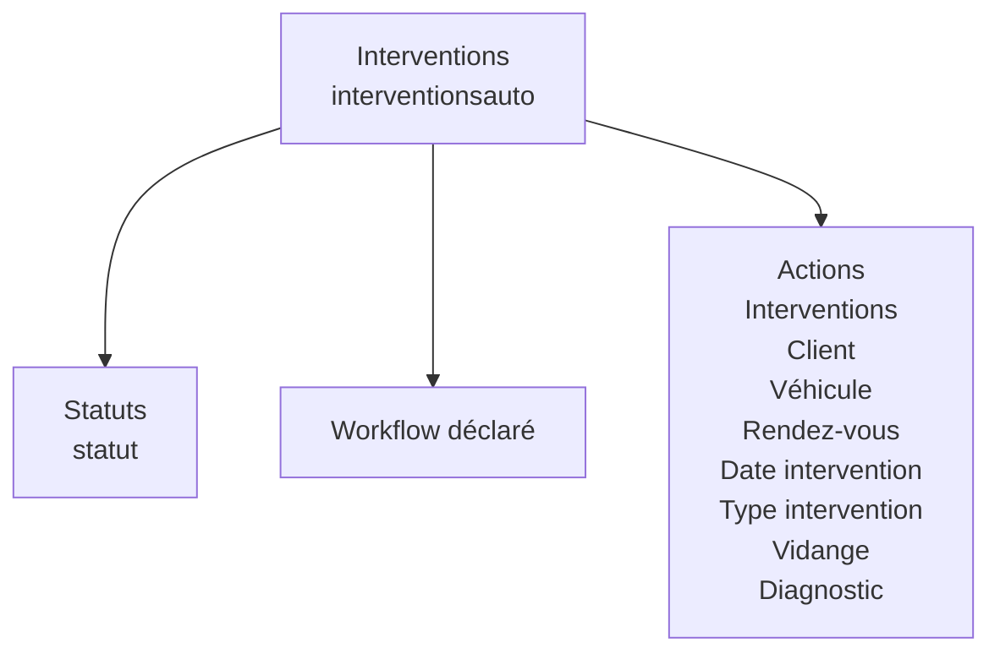

### Lignes commande stock — `lignescommandestockauto`

- Fichier : `src/runtime/modules/generated/lignescommandestockauto/lignescommandestockauto.module.ts`
- Champs de statut : `statut`
- Workflow : oui
- États détectés : non détectés
- Actions détectées : aucune action explicite détectée
- Enfants/composition : receptions-ligne-commande

```mermaid
flowchart TD
  A["Lignes commande stock<br/>lignescommandestockauto"]
  S["Statuts<br/>statut"]
  A --> S
  W["Workflow déclaré"]
  A --> W
```

### Lignes intervention — `lignesinterventionauto`

- Fichier : `src/runtime/modules/generated/lignesinterventionauto/lignesinterventionauto.module.ts`
- Actions : `src/runtime/modules/generated/lignesinterventionauto/lignesinterventionauto.actions.ts`
- Champs de statut : `statut`
- Workflow : oui
- États détectés : non détectés
- Actions détectées : Lignes intervention, Intervention, Produit / pièce, Stock source, Code produit, Nom produit, Type article, Pièce, Main d’œuvre, Service, Remise, Désignation, Type ligne, Quantité, Prix unitaire, Prix unitaire HT, TVA (%), Montant HT, Montant TVA, Montant TTC, Montant total, Statut, Brouillon, Validée, Mouvement stock, Stock traité le, Quantité traitée en stock, Observations, Ligne, Notes, Retirer la ligne, Cycle ligne intervention
- Enfants/composition : aucun enfant détecté

```mermaid
flowchart TD
  A["Lignes intervention<br/>lignesinterventionauto"]
  S["Statuts<br/>statut"]
  A --> S
  W["Workflow déclaré"]
  A --> W
  AC["Actions<br/>Lignes intervention<br/>Intervention<br/>Produit / pièce<br/>Stock source<br/>Code produit<br/>Nom produit<br/>Type article<br/>Pièce"]
  A --> AC
```

### Livraisons — `livraisons`

- Fichier : `src/runtime/modules/definitions/generated/livraisons.module.ts`
- Champs de statut : `statut`
- Workflow : non
- États détectés : non détectés
- Actions détectées : aucune action explicite détectée
- Enfants/composition : aucun enfant détecté

```mermaid
flowchart TD
  A["Livraisons<br/>livraisons"]
  S["Statuts<br/>statut"]
  A --> S
```

### Maintenance — `maintenance`

- Fichier : `src/runtime/modules/definitions/generated/maintenance.module.ts`
- Champs de statut : `statut`
- Workflow : non
- États détectés : non détectés
- Actions détectées : aucune action explicite détectée
- Enfants/composition : aucun enfant détecté

```mermaid
flowchart TD
  A["Maintenance<br/>maintenance"]
  S["Statuts<br/>statut"]
  A --> S
```

### Materiels — `materiels`

- Fichier : `src/runtime/modules/definitions/generated/materiels.module.ts`
- Champs de statut : `statut`
- Workflow : non
- États détectés : non détectés
- Actions détectées : aucune action explicite détectée
- Enfants/composition : aucun enfant détecté

```mermaid
flowchart TD
  A["Materiels<br/>materiels"]
  S["Statuts<br/>statut"]
  A --> S
```

### Mouvements — `mouvements`

- Fichier : `src/runtime/modules/definitions/generated/mouvements.module.ts`
- Champs de statut : `statut`
- Workflow : non
- États détectés : non détectés
- Actions détectées : aucune action explicite détectée
- Enfants/composition : aucun enfant détecté

```mermaid
flowchart TD
  A["Mouvements<br/>mouvements"]
  S["Statuts<br/>statut"]
  A --> S
```

### Mouvements stock — `mouvementsstockauto`

- Fichier : `src/runtime/modules/generated/mouvementsstockauto/mouvementsstockauto.module.ts`
- Champs de statut : `statut`
- Workflow : oui
- États détectés : non détectés
- Actions détectées : aucune action explicite détectée
- Enfants/composition : aucun enfant détecté

```mermaid
flowchart TD
  A["Mouvements stock<br/>mouvementsstockauto"]
  S["Statuts<br/>statut"]
  A --> S
  W["Workflow déclaré"]
  A --> W
  AC["Actions détectées"]
  A --> AC
```

### Paiements — `paiements`

- Fichier : `src/runtime/modules/definitions/generated/paiements.module.ts`
- Champs de statut : `statut`
- Workflow : non
- États détectés : non détectés
- Actions détectées : aucune action explicite détectée
- Enfants/composition : aucun enfant détecté

```mermaid
flowchart TD
  A["Paiements<br/>paiements"]
  S["Statuts<br/>statut"]
  A --> S
```

### Produits — `produits`

- Fichier : `src/runtime/modules/definitions/generated/produits.module.ts`
- Champs de statut : `statut`
- Workflow : non
- États détectés : non détectés
- Actions détectées : aucune action explicite détectée
- Enfants/composition : aucun enfant détecté

```mermaid
flowchart TD
  A["Produits<br/>produits"]
  S["Statuts<br/>statut"]
  A --> S
```

### Produits — `produitsauto`

- Fichier : `src/runtime/modules/generated/produitsauto/produitsauto.module.ts`
- Actions : `src/runtime/modules/generated/produitsauto/produitsauto.actions.ts`
- Champs de statut : `statut`
- Workflow : oui
- États détectés : non détectés
- Actions détectées : aucune action explicite détectée
- Enfants/composition : aucun enfant détecté

```mermaid
flowchart TD
  A["Produits<br/>produitsauto"]
  S["Statuts<br/>statut"]
  A --> S
  W["Workflow déclaré"]
  A --> W
  AC["Actions détectées"]
  A --> AC
```

### Rappels — `rappelsauto`

- Fichier : `src/runtime/modules/generated/rappelsauto/rappelsauto.module.ts`
- Actions : `src/runtime/modules/generated/rappelsauto/rappelsauto.actions.ts`
- Champs de statut : `statut`
- Workflow : oui
- États détectés : non détectés
- Actions détectées : aucune action explicite détectée
- Enfants/composition : aucun enfant détecté

```mermaid
flowchart TD
  A["Rappels<br/>rappelsauto"]
  S["Statuts<br/>statut"]
  A --> S
  W["Workflow déclaré"]
  A --> W
  AC["Actions détectées"]
  A --> AC
```

### Receptions stock — `receptionsstockauto`

- Fichier : `src/runtime/modules/generated/receptionsstockauto/receptionsstockauto.module.ts`
- Champs de statut : `statut`
- Workflow : oui
- États détectés : non détectés
- Actions détectées : aucune action explicite détectée
- Enfants/composition : mouvements-stock-reception

```mermaid
flowchart TD
  A["Receptions stock<br/>receptionsstockauto"]
  S["Statuts<br/>statut"]
  A --> S
  W["Workflow déclaré"]
  A --> W
```

### Rendez-vous — `rendezvous`

- Fichier : `src/runtime/modules/generated/rendezvous/rendezvous.module.ts`
- Actions : `src/runtime/modules/generated/rendezvous/rendezvous.actions.ts`
- Champs de statut : `statut`
- Workflow : oui
- États détectés : non détectés
- Actions détectées : Rendez-vous, Code rendez-vous, Client, Véhicule, Date rendez-vous, Heure, Durée prévue, Début créneau, Fin créneau, Intervention liée, Type service, Vidange, Diagnostic, Réparation, Contrôle, Autre, Motif, Commentaire, Statut, Planifié, Confirmé, En cours, Terminé, Annulé, Planification, Détails, Total, Confirmés, Annulés, Type de service, Rendez-vous affichés, Cycle rendez-vous, Confirmer le RDV, Démarrer le RDV, Terminer le RDV, Annuler
- Enfants/composition : interventions-rendezvous

```mermaid
flowchart TD
  A["Rendez-vous<br/>rendezvous"]
  S["Statuts<br/>statut"]
  A --> S
  W["Workflow déclaré"]
  A --> W
  AC["Actions<br/>Rendez-vous<br/>Code rendez-vous<br/>Client<br/>Véhicule<br/>Date rendez-vous<br/>Heure<br/>Durée prévue<br/>Début créneau"]
  A --> AC
```

### Stocks — `stocks`

- Fichier : `src/runtime/modules/definitions/generated/stocks.module.ts`
- Champs de statut : `statut`
- Workflow : non
- États détectés : non détectés
- Actions détectées : aucune action explicite détectée
- Enfants/composition : aucun enfant détecté

```mermaid
flowchart TD
  A["Stocks<br/>stocks"]
  S["Statuts<br/>statut"]
  A --> S
```

### Stocks — `stocksauto`

- Fichier : `src/runtime/modules/generated/stocksauto/stocksauto.module.ts`
- Actions : `src/runtime/modules/generated/stocksauto/stocksauto.actions.ts`
- Champs de statut : `statut`
- Workflow : oui
- États détectés : non détectés
- Actions détectées : aucune action explicite détectée
- Enfants/composition : aucun enfant détecté

```mermaid
flowchart TD
  A["Stocks<br/>stocksauto"]
  S["Statuts<br/>statut"]
  A --> S
  W["Workflow déclaré"]
  A --> W
  AC["Actions détectées"]
  A --> AC
```

### Terrains — `terrains`

- Fichier : `src/runtime/modules/definitions/generated/terrains.module.ts`
- Champs de statut : `statut`
- Workflow : non
- États détectés : non détectés
- Actions détectées : aucune action explicite détectée
- Enfants/composition : aucun enfant détecté

```mermaid
flowchart TD
  A["Terrains<br/>terrains"]
  S["Statuts<br/>statut"]
  A --> S
```

### Véhicules — `vehicules`

- Fichier : `src/runtime/modules/generated/vehicules/vehicules.module.ts`
- Actions : `src/runtime/modules/generated/vehicules/vehicules.actions.ts`
- Champs de statut : `statut`
- Workflow : oui
- États détectés : non détectés
- Actions détectées : aucune action explicite détectée
- Enfants/composition : rendezvous, interventions, factures-vehicule

```mermaid
flowchart TD
  A["Véhicules<br/>vehicules"]
  S["Statuts<br/>statut"]
  A --> S
  W["Workflow déclaré"]
  A --> W
  AC["Actions détectées"]
  A --> AC
```

## Recommandation de prochaine passe

1. Extraire un composant runtime unique type `ERPRuntimeActionBar` pour rendre les actions hors formulaire.
2. Retirer `workflowActions` de `ERPEnterpriseForm`.
3. Faire porter les actions par `ERPRuntimePage` ou un moteur runtime dédié.
4. Ajouter un audit bloquant : aucun bouton workflow/action ne doit être rendu dans les formulaires.
5. Ajouter un audit bloquant : aucune création enfant avec `requiresParentContext` ne doit avoir une URL manuelle sans parent context.